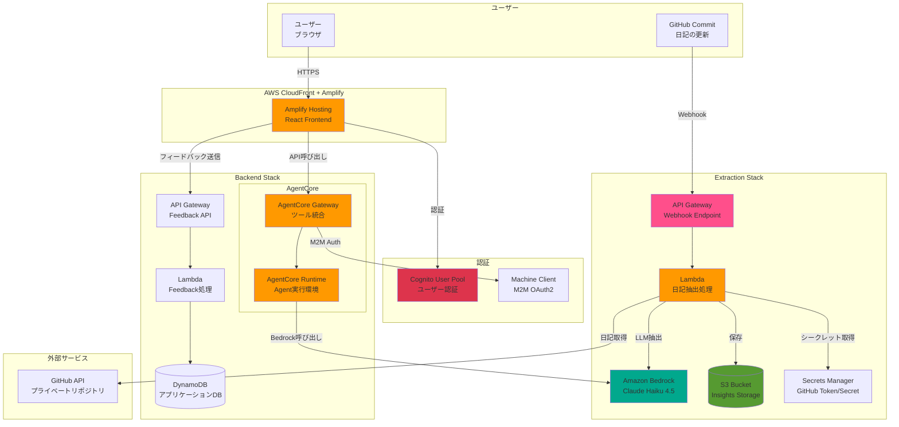
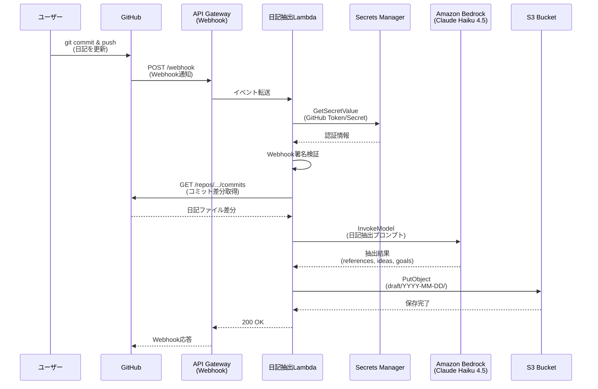
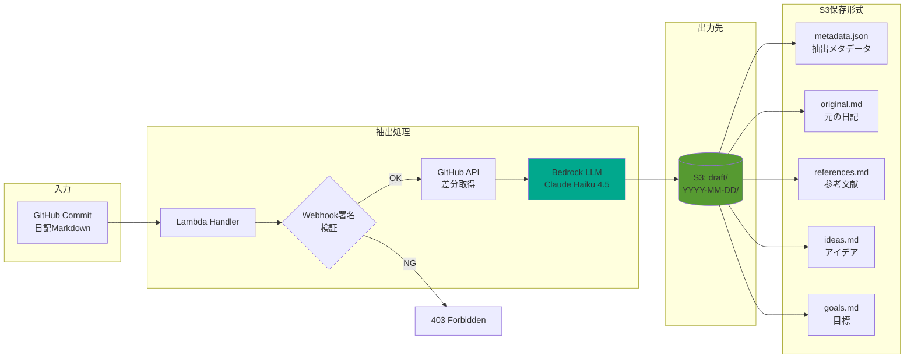
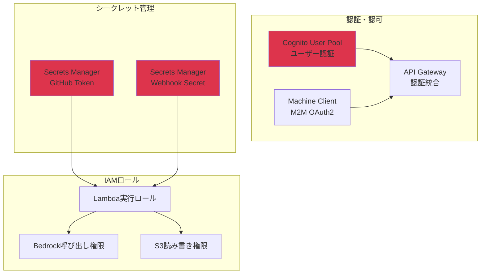
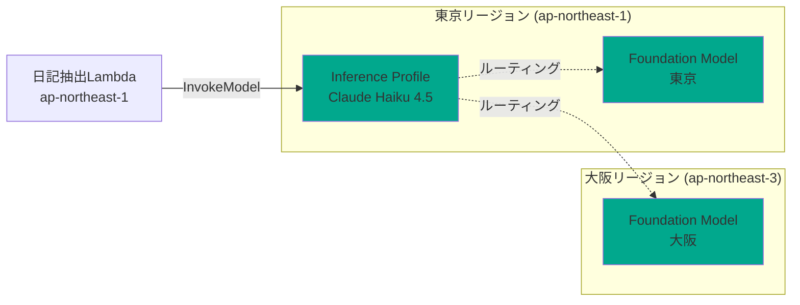

# Diary Insight Agent - アーキテクチャドキュメント

## 概要

このドキュメントは、Diary Insight Agentのシステムアーキテクチャを図解します。
本システムは、GitHubリポジトリから日記を自動抽出し、Amazon Bedrockで分析してS3に保存するフルスタックAWSアプリケーションです。

---

## 1. システム全体構成図



---

## 2. CDKスタック構成と依存関係

```mermaid
graph LR
    subgraph "Main Stack"
        Main[FastMainStack<br/>オーケストレーター]
    end

    subgraph "Nested Stacks"
        Cognito[CognitoStack<br/>認証基盤]
        Backend[BackendStack<br/>AgentCore + API]
        Amplify[AmplifyHostingStack<br/>フロントエンド]
        Extraction[ExtractionStack<br/>日記抽出]
    end

    Main --> Cognito
    Main --> Backend
    Main --> Amplify
    Main --> Extraction

    Cognito -->|User Pool ID<br/>Client ID| Backend
    Backend -->|Insights Bucket| Extraction
    Backend -->|Runtime ARN<br/>API Endpoint| Amplify

    style Main fill:#232F3E
    style Cognito fill:#DD344C
    style Backend fill:#FF9900
    style Amplify fill:#FF9900
    style Extraction fill:#527FFF
```



**デプロイ順序**:
1. `CognitoStack` - User Pool、OAuth2設定
2. `BackendStack` - AgentCore Gateway/Runtime、DynamoDB、Feedback API
3. `AmplifyHostingStack` - Reactフロントエンドホスティング
4. `ExtractionStack` - GitHub Webhook受信、日記抽出Lambda

---

## 3. 日記抽出フロー（詳細）



**処理時間**: 約30秒〜1分（Bedrock呼び出しを含む）

---

## 4. データフロー図



**S3保存パス**:
```
s3://diary-insight-agent-insights/
└── draft/
    └── YYYY-MM-DD/
        ├── metadata.json      # 抽出日時、LLMモデル、統計情報
        ├── original.md        # 元の日記（GitHub取得内容）
        ├── references.md      # 参考文献・リンク
        ├── ideas.md           # アイデア・気づき
        └── goals.md           # 目標・タスク
```

---

## 5. AgentCore Gateway構成図

```mermaid
graph TB
    subgraph "AgentCore Gateway"
        Gateway[Gateway API<br/>ツールルーター]

        subgraph "Lambda Tools"
            Tool1[Tool Lambda 1<br/>example_tool]
            Tool2[Tool Lambda 2<br/>custom_tool]
        end
    end

    subgraph "AgentCore Runtime"
        Runtime[Runtime<br/>Agent実行環境]
        Agent[Agent Container<br/>ZIP or Docker]
    end

    Frontend[Frontend<br/>React App] -->|API呼び出し| Gateway
    Gateway --> Tool1
    Gateway --> Tool2

    Runtime --> Agent
    Agent -->|ツール呼び出し| Gateway

    Gateway -->|M2M Auth| MachineClient[Machine Client<br/>OAuth2]

    style Gateway fill:#FF9900
    style Runtime fill:#527FFF
    style Agent fill:#232F3E
```



**Gatewayの役割**:
- Lambdaベースのツールを動的に登録
- M2M認証（OAuth2 Client Credentials）
- AgentCore Runtimeからのツール呼び出しをルーティング

---

## 6. 主要AWSリソース一覧

| リソース種別 | 用途 | スタック |
|-------------|------|---------|
| **Cognito User Pool** | ユーザー認証、OAuth2 | CognitoStack |
| **Lambda (Extraction)** | 日記抽出処理（Python 3.13） | ExtractionStack |
| **Lambda (Feedback)** | フィードバック処理 | BackendStack |
| **Lambda (Gateway Tools)** | AgentCoreツール実装 | BackendStack |
| **API Gateway (Webhook)** | GitHub Webhook受信 | ExtractionStack |
| **API Gateway (Feedback)** | フィードバックAPI | BackendStack |
| **S3 Bucket (Insights)** | 日記抽出結果保存 | BackendStack |
| **DynamoDB Table** | アプリケーションデータ | BackendStack |
| **Secrets Manager** | GitHub Token/Webhook Secret | 手動作成 |
| **Bedrock (Claude Haiku 4.5)** | 日記抽出LLM | ExtractionStack |
| **AgentCore Gateway** | ツール統合基盤 | BackendStack |
| **AgentCore Runtime** | Agent実行環境 | BackendStack |
| **Amplify Hosting** | Reactフロントエンド | AmplifyHostingStack |

---

## 7. セキュリティ構成



**セキュリティベストプラクティス**:
- ✅ Secrets ManagerでGitHub認証情報を管理
- ✅ Webhook署名検証（HMAC SHA-256）
- ✅ S3バケットはプライベート（BlockPublicAccess）
- ✅ Lambda実行ロールは最小権限（Bedrock、S3のみ）
- ✅ Geographic CRIS（東京・大阪リージョン限定）

---

## 8. Bedrock権限設定（Geographic CRIS）



**Geographic CRIS設定**:
- Inference Profile: `jp.anthropic.claude-haiku-4-5-20251001-v1:0`
- Destination Regions: 東京（ap-northeast-1）、大阪（ap-northeast-3）
- IAMポリシーで両方のリージョンへのアクセスを許可

---

## 9. デプロイメントフロー

```mermaid
flowchart TB
    Start([開発者]) --> Config[config.yaml編集]
    Config --> Secrets[Secrets Manager設定<br/>GitHub Token/Secret]
    Secrets --> CDKBuild[npm run build]
    CDKBuild --> CDKDeploy[cdk deploy --all]

    CDKDeploy --> DeployCognito[CognitoStack<br/>デプロイ]
    DeployCognito --> DeployBackend[BackendStack<br/>デプロイ]
    DeployBackend --> DeployAmplify[AmplifyHostingStack<br/>デプロイ]
    DeployBackend --> DeployExtraction[ExtractionStack<br/>デプロイ]

    DeployExtraction --> ConfigWebhook[GitHub Webhook設定<br/>手動]
    ConfigWebhook --> Test[動作確認]
    Test --> Done([完了])

    style Start fill:#232F3E
    style Secrets fill:#DD344C
    style Done fill:#569A31
```



**手動設定が必要な項目**:
1. Secrets Managerに`github-token`と`github-webhook-secret`を作成
2. GitHub Webhook URLをリポジトリ設定に追加（API Gateway URLを使用）

---

## 10. コスト最適化

| リソース | 月間コスト概算 | 最適化施策 |
|---------|--------------|----------|
| Lambda（日記抽出） | $0.20 | 実行時間15分、月間30回 |
| Bedrock（Claude Haiku 4.5） | $0.50 | Input: 2K tokens, Output: 1K tokens × 30回 |
| S3（Insights Storage） | $0.05 | 標準ストレージ、1GB未満 |
| API Gateway | $0.01 | 月間30リクエスト |
| DynamoDB | $0.00 | オンデマンド、低トラフィック |
| Amplify Hosting | $0.00 | 無料枠内 |
| **合計** | **$0.76/月** | |

**コスト削減のポイント**:
- ✅ API Gatewayキャッシュ無効化（不要な固定費削減）
- ✅ CloudWatch Logs保持期間: 1週間
- ✅ S3バケット: `RemovalPolicy.DESTROY`（テスト環境）
- ✅ CDKリソースタグでコスト追跡

---

## 11. モニタリング・ログ

| ログ種別 | ロググループ | 保持期間 |
|---------|------------|---------|
| 日記抽出Lambda | `/aws/lambda/diary-insight-agent-diary-extraction` | 7日 |
| Feedback Lambda | `/aws/lambda/diary-insight-agent-feedback-*` | 7日 |
| API Gateway（Webhook） | API Gateway自動生成 | 7日 |

**モニタリング指標**:
- Lambda実行時間（目標: <60秒）
- Bedrock呼び出しエラー率（目標: <1%）
- S3保存成功率（目標: 100%）

---

## 参考リンク

- [AWS CDK Documentation](https://docs.aws.amazon.com/cdk/)
- [Amazon Bedrock User Guide](https://docs.aws.amazon.com/bedrock/)
- [AgentCore Gateway Documentation](./GATEWAY.md)
- [Deployment Guide](./DEPLOYMENT.md)
- [Local Development Guide](./LOCAL_DEVELOPMENT.md)

---

**最終更新**: 2026-04-18
**バージョン**: v0.3.1
